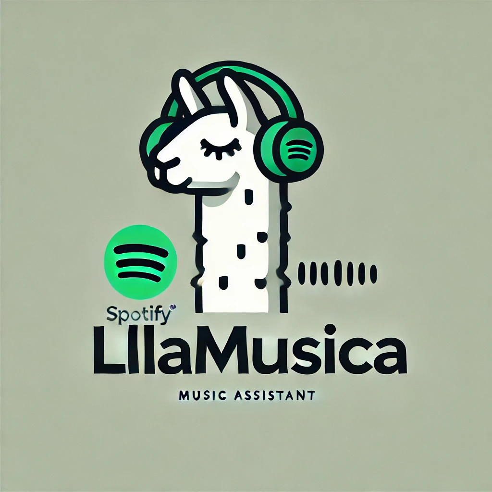
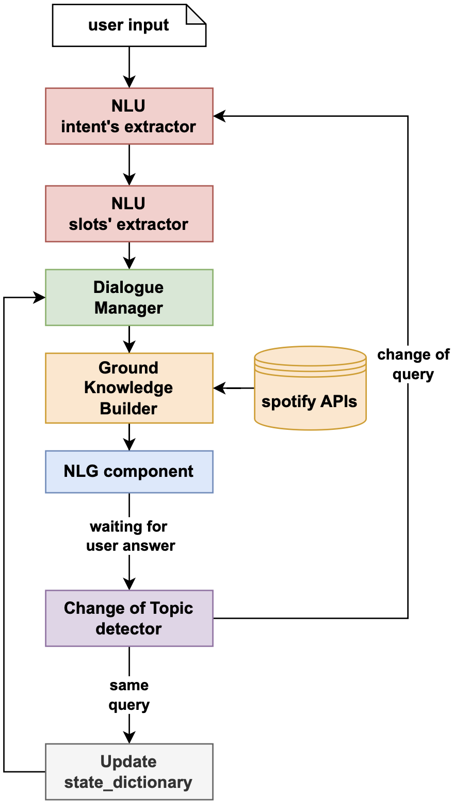

<p align="center"> 
   
</p> 


# 🎵🐪 **LLAMusica** - AI-Powered Spotify Chatbot  

> 🎧 **Your intelligent music assistant, one conversation at a time!**  

LLAMusica is an AI-driven conversational assistant that enhances the way users discover and interact with music. By integrating **Spotify APIs** with **Llama3.2**, it provides detailed insights into songs, artists, albums, and user listening habits—all through a seamless and engaging chatbot experience.  

You can find a video of some study cases [here](https://youtu.be/YRIkrx3f7iA).

---


## Key Features  

- **Song Search & Insights**  
  Retrieve song details, including release dates, popularity, duration, and artists.  

- **Artist Exploration**  
  Get in-depth artist profiles, including discographies, genres, and popularity.  

- **Album Discovery**  
  Access tracklists, release dates, and artists involved for any album.  

- **Personalized Recommendations**  
  Receive curated song suggestions based on genre preferences.  

- **User Analytics**  
  Fetch user top tracks and artists over different time frames.  

- **Multi-Intent Handling**  
  Process complex queries involving multiple intents simultaneously.
  
- **Context-Aware Conversations**  
  Retains and updates conversation state dynamically, ensuring continuity and accurate responses.  

- **Out-of-Domain Handling**  
  Detects and gracefully handles queries outside the system’s scope.  

---

## Objective  

LLAMusica is designed to provide a **seamless and intelligent** music discovery experience by combining the conversational capabilities of **Llama3.2** with the real-time music data from **Spotify APIs**. The system enables users to explore music in a structured, interactive manner, reducing the effort needed to retrieve relevant information.  

---

## Tech Stack  

- **Spotify API** – Provides real-time music metadata and user listening analytics.  
- **Llama3.2** – Advanced natural language processing for conversation management.  
- **Python** – Backend logic for processing user queries and managing API calls.  
- **Pandas & CSV** – Used for testing and evaluation of NLU components.  
- **Regex & NLP Techniques** – Used for slot extraction, intent classification, and data validation.  

---

## System Architecture  

LLAMusica follows a structured **Natural Language Understanding (NLU) and Dialogue Management (DM)** pipeline:  

### 1. Intent & Slot Extraction (NLU)  
- Extracts **user intent** (e.g., "Tell me about The Weeknd").  
- Identifies relevant **slots** (e.g., `artist_name: The Weeknd`).  

### 2. Dialogue Management (DM)  
- Determines the **next best action** based on user input.  
- Handles **multi-intent** scenarios and context tracking.  

### 3. General Knowledge (GK) Processing  
- Fetches information from **Spotify APIs**.  
- Constructs structured responses using extracted data.  

### 4. Natural Language Generation (NLG)  
- Generates **human-like responses** based on the extracted data.  
- Adapts responses dynamically to maintain conversation context.  

<p align="center"> 
   <br> <i>Figure 1: LLAMusica complete pipeline.</i> 
</p> 

---

## Evaluation and Testing  

LLAMusica undergoes structured evaluation, ensuring high accuracy in **intent detection, slot extraction, and dialogue management**.  

- **NLU Evaluation** – Assesses performance by comparing extracted intents and slots with expected outputs.  
- **Dialogue Management Validation** – Ensures correct next-best-action selection.  
- **Similarity Metrics** – Uses similarity measurements to validate response accuracy (in addiction to human quality evaluation).  

**Test Results Summary:**  

| Component              | Correct Predictions | Accuracy |
|------------------------|---------------------|----------|
| NLU - Intent Extractor | 43/50               | 86%      |
| NLU - Slots Extractor  | 41/50               | 82%      |
| Dialogue Manager       | 45/50               | 90%      |

---

## Project Structure
```
LLAMusica/
│── assets/                 # Contains images and logos fro the README.md
│── evaluation/             # Contains test data and evaluation results
│── prompts/                # Contains system prompts for different components
│ ├── prompt_COT_detection.txt
│ ├── prompt_DM.txt
│ ├── prompt_NLG.txt
│ ├── prompt_NLU_intents.txt
│ ├── prompt_COT_detection.txt
│ ├── prompt_NLU_slots.txt
│ ├── prompt_USD.txt
│
│── eval.py                 # Evaluation script for model performance
│── main.py                 # Entry point for chatbot execution
│── model_query.py          # Handles model interaction with LLaMa
│── spoti.py                # Spotify API handling
│── statedictmanager.py     # State management for conversation flow
│── utils.py                # Utility functions
```

## Installation and Setup  

### 1. Clone the Repository  
```bash
git clone https://github.com/your-username/LLAMusica.git
cd LLAMusica
```
### 2. Install Dependencies
```bash
pip install -r requirements.txt
```

### 3. Set Up Spotify API Credentials
Create a .env file and add your Spotify API credentials:

```bash
SPOTIPY_CLIENT_ID="your_client_id"
SPOTIPY_CLIENT_SECRET="your_client_secret"
SPOTIPY_REDIRECT_URI="http://localhost:8080"
```

### 4. Run the Chatbot
```bash
python main.py
```

# Contacts
For any inquiries, feel free to contact:

- Stefano Bonetto - [stefano.bonetto@studenti.unitn.it](mailto:stefano.bonetto@studenti.unitn.it)

<br>

<div>
    <a href="https://www.unitn.it/">
        
    </a>
</div>
